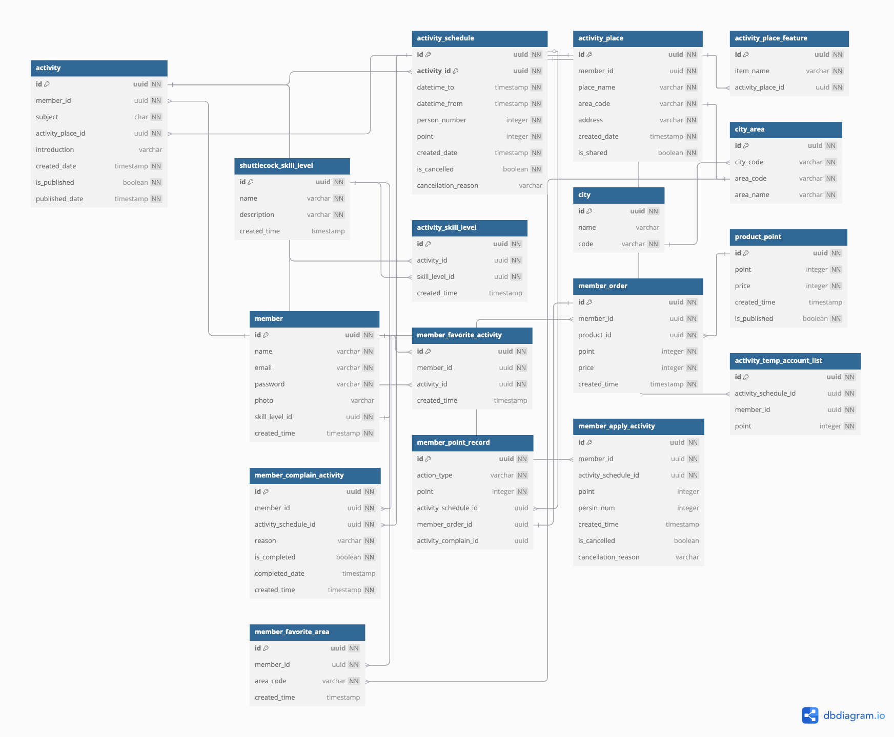

# shuttler-backend

## DB Schema



## Directory Structure

```
shuttler-backend/
├── bin/
│   └── www          # server script
├── node_modules/    # npm dependency
├── public/          # 靜態檔案
├── src/             # 應用程式
│   ├── config/      # 設定檔
│   ├── controllers/ # 控制器
│   ├── db/          # 資料庫連線
│   ├── entities/    # TypeORM db entity
│   ├── middleware/  # 中介軟體
│   ├── routes/      # 路由
│   │   └── v1/      # v1版本路由
│   ├── utils/       # 通用工具
│   └── app.js       # Express
├── .env
├── .gitignore
├── package.json
└── package-lock.json
```
